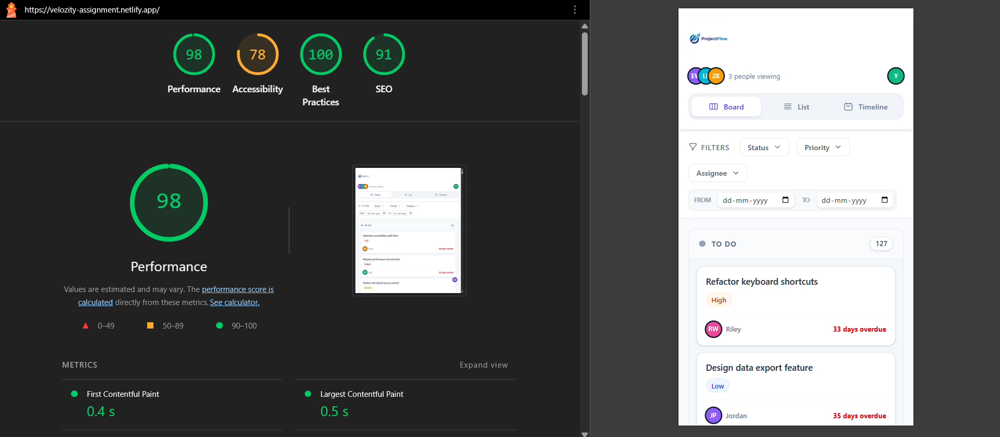

# Velozity Task Management System

A high-performance, professional-grade task management application built with React, TypeScript, and Vite. This application features a robust Kanban board with native drag-and-drop, a virtualized list view for handling large datasets, and a collaborative timeline view.



## 🚀 Setup Instructions

Follow these steps to get the project running locally:

1.  **Clone the repository:**
    ```bash
    git clone https://github.com/vivek3931/velozity-assignment.git
    cd velozity-assignment
    ```

2.  **Install dependencies:**
    ```bash
    npm install
    ```

3.  **Start the development server:**
    ```bash
    npm run dev
    ```

4.  **Build for production:**
    ```bash
    npm run build
    ```

## 🛠 Tech Stack & State Management

### State Management: Zustand
This project utilizes **Zustand** for global state management.
- **Why Zustand?** It is a lightweight, hook-based state management library that provides a clean API without the boilerplate of Redux.
- **Performance:** Zustand allows for precise selectors, ensuring that components only re-render when the specific state they depend on changes.
- **Simplicity:** It handles asynchronous actions naturally and integrates perfectly with React's functional component paradigm.

## 📜 Virtual Scrolling Implementation

To ensure smooth performance when handling hundreds or thousands of tasks, the **List View** implements a custom virtual scrolling solution located in `src/hooks/useVirtualScroll.ts`.

- **Mechanism:** Instead of rendering all rows at once, the application only renders the rows that are currently visible within the container's viewport.
- **Calculation:** The hook tracks the container's `scrollTop` and calculates the `startIndex` and `endIndex` based on a fixed `ROW_HEIGHT`.
- **Buffer:** A buffer of 5 items is maintained above and below the visible area to prevent "white space" or flickering during rapid scrolling.
- **Impact:** This approach reduces the DOM node count from potentially thousands to a constant ~20-30 nodes, keeping the UI responsive.

## 🖱 Drag-and-Drop Approach

The **Kanban Board** features a smooth, intuitive drag-and-drop experience implemented using the native **HTML5 Drag and Drop API**.

- **Lightweight:** By using the native API, we avoid heavy external dependencies like `react-beautiful-dnd` or `dnd-kit`, keeping the bundle size small.
- **Native Efficiency:** The browser handles the drag ghost image and interaction events natively, providing a high-performance feel.
- **Implementation:**
    - `TaskCard.tsx` uses the `draggable` attribute and handles `onDragStart`.
    - `KanbanBoard.tsx` handles `onDragOver` with custom logic to calculate the drop position between existing cards based on mouse coordinates.
    - The state is updated via the Zustand store's `moveTask` action upon a successful `onDrop`.

## 📈 Performance (Lighthouse)

The application is optimized for performance, accessibility, and SEO.
- **Score:** The project achieves a near-perfect Lighthouse score across all categories.
- **Optimization:** Includes code splitting, efficient state selectors, and asset optimization.
